# - 메인 화면 구성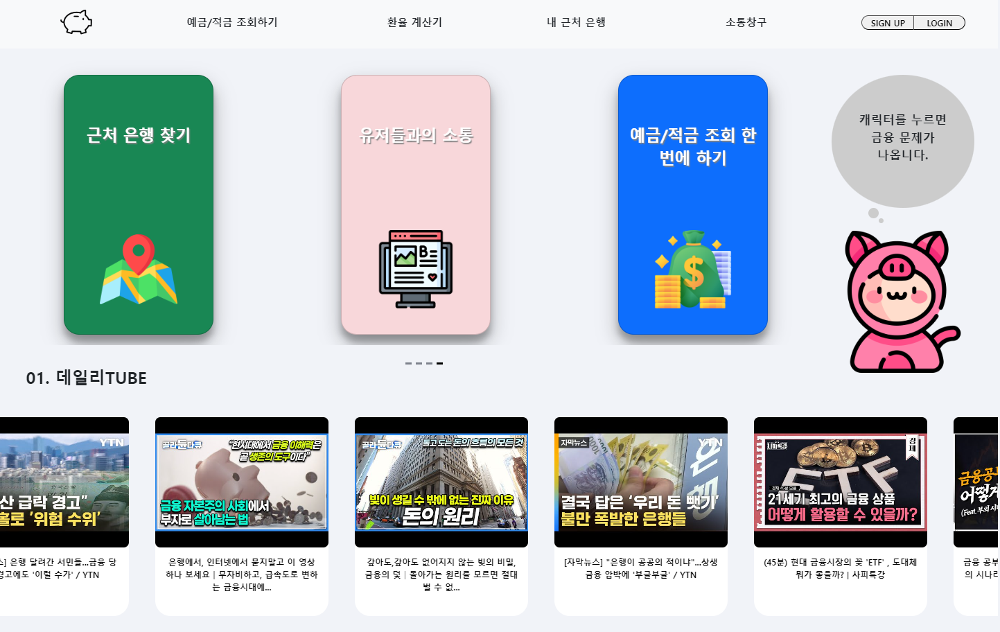

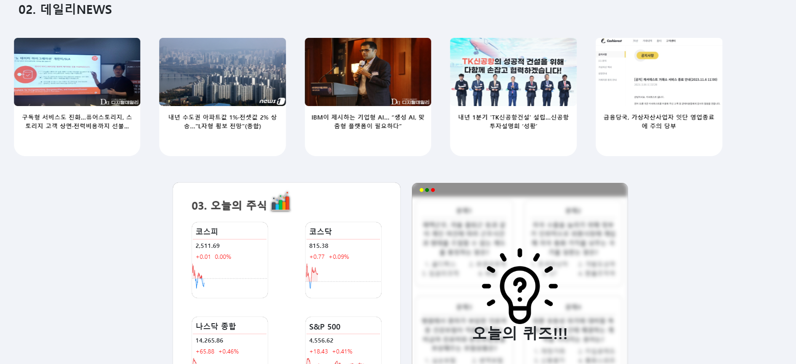

구현한 기능으로 가는 카드를 캐로젤 형식으로 구현

금융 관련 데일리 유튜브, 데일리 뉴스 카드를 캐로젤 형식으로 구현

오늘 국내, 해외 지수와 지수를 누를 시 그와 관련된 주식정보 모달이 열림

간단한 금융 퀴즈

#### - 환율계산기

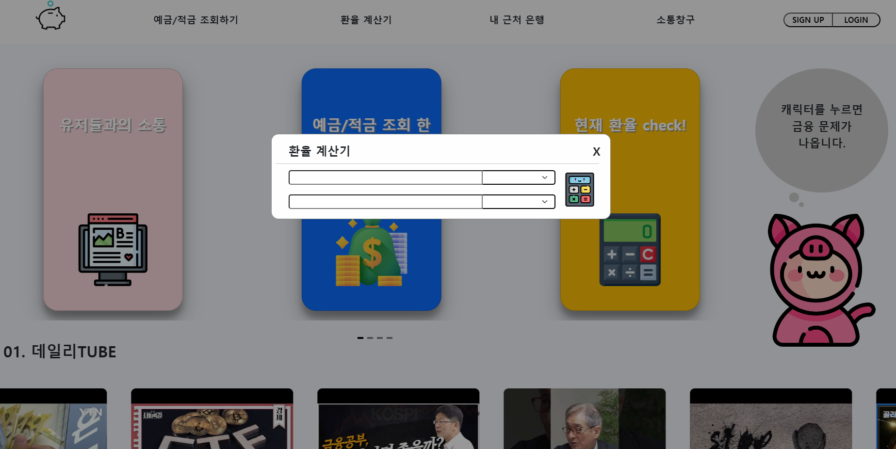

환율 계산기는 간단한 기능으로 어떤 페이지에서든 모달로 뜰 수 있도록 구현

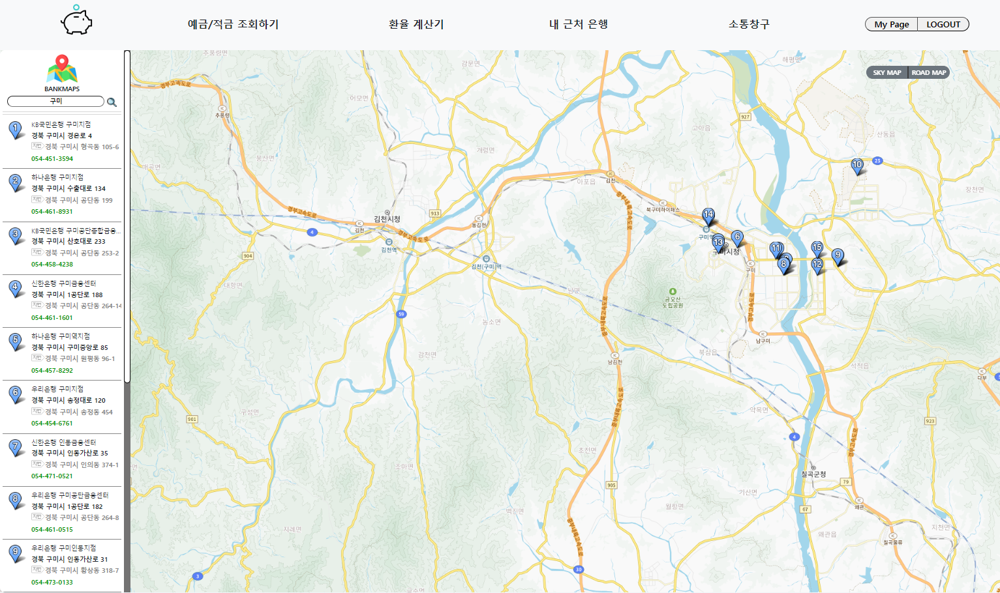

지역 정보를 입력하면 그 지역 은행을 모두 추천

왼쪽에는 은행 리스트가 지도에는 은행위치가 핀으로 찍힌다.

#### - 유저 소통 게시판

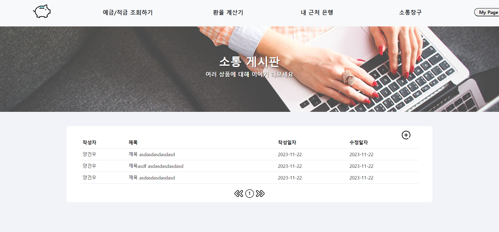

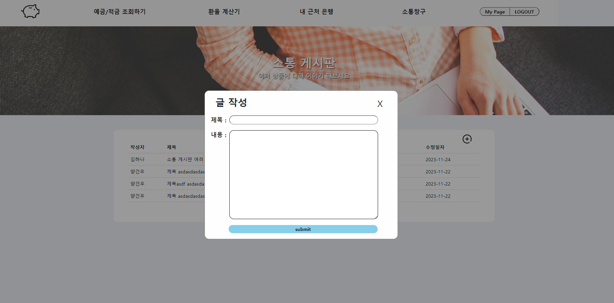

일반적인 게시판 및 댓글 구현

게시글 상세및 작성을 모달로 구현

#### - 프로필 페이지

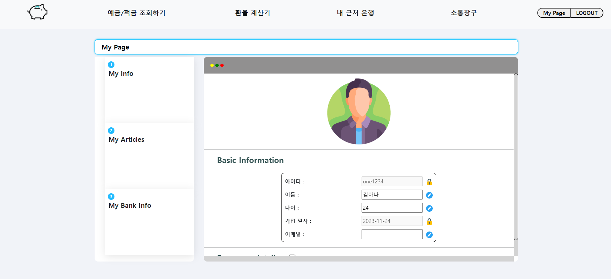

프로필을 유저 정보를 하나하나 변경 가능하다.

월급 재산 등 민감한 정보는 아래의 디테일에서 눌러야 보이게 만들었다.

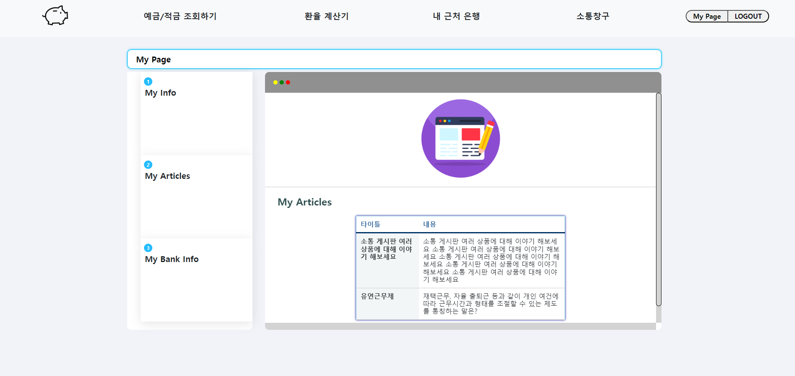

내가 작성한 게시글을 조회 가능하다.

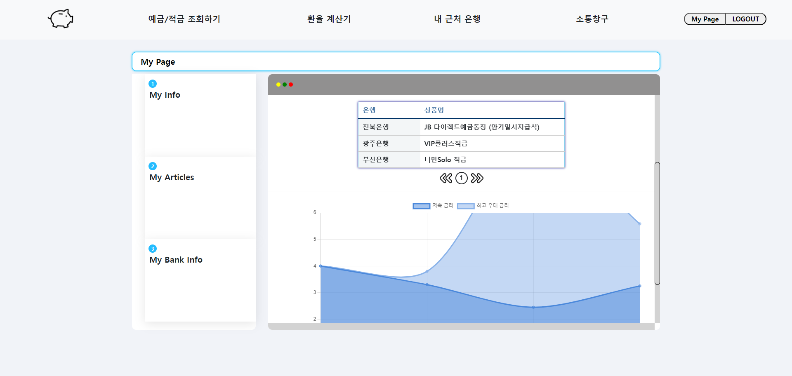

내가 가입한 상품 조회와 되회된 상품의 그래프를 볼 수 있다.

#### - 예적금 비교 페이지

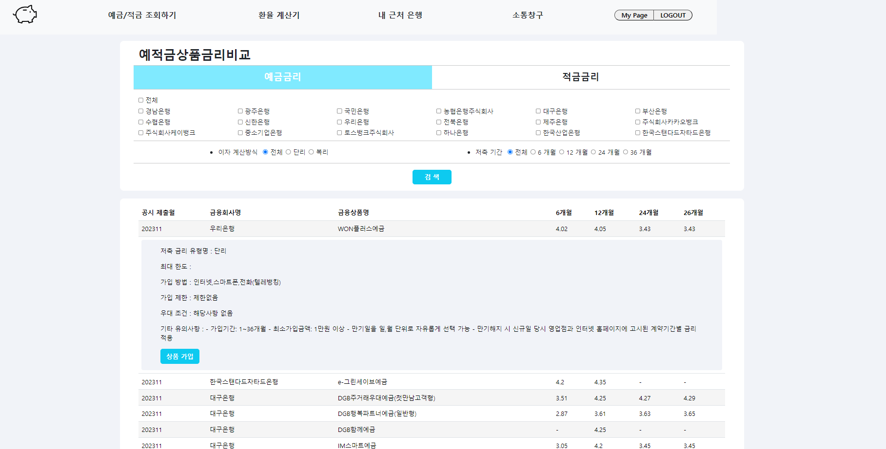

내가 원하는 예금 적금으로 나누어 은행, 이자 계산 방식, 저축기간을 선택해서 검색가능

상품을 눌러 상세정보를 보고 가입가능

#### - 금융 상품 추천 페이지

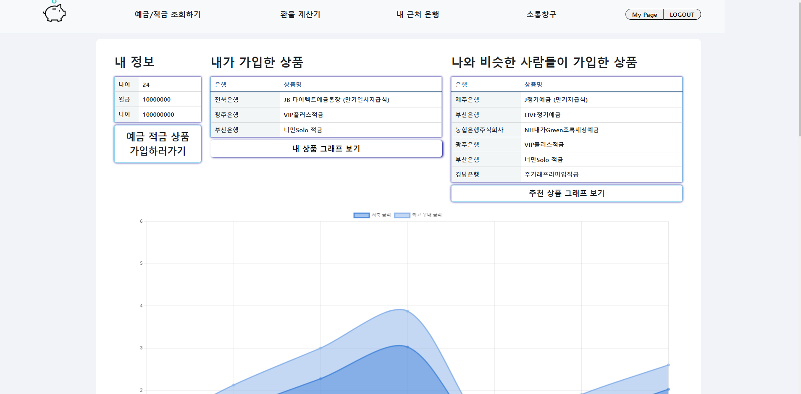

내가 가입한 상품과 추천 상품을 한번에 보면서 비교 가능하다.

# 데이터베이스 모델링(ERD)

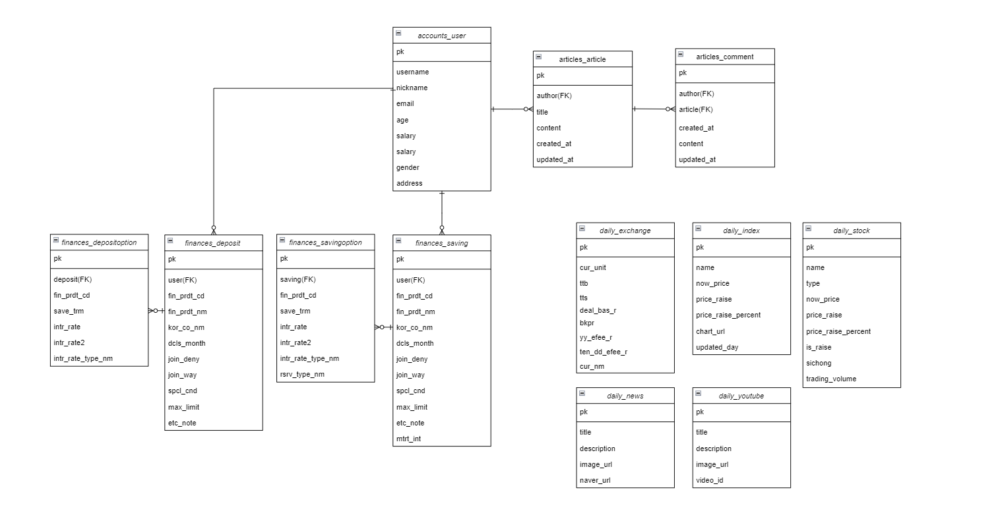

# 금융 상품 추천 알고리즘에 대한 기술적 설명

#### 예적금 추천 알고리즘

전체 유저 데이터에서 월급, 제산, 나이 데이터를 뽑아 유저간의 코사인 유사도를 계산한다.

그 후 나와 비슷한 사람 100명을 뽑아서 그 사람들이 가입한 상품을 추합하여 가장 많이 가입한 예금 상품 3개 적금 상품 3개를 추천해준다.

### 카드 추천 알고리즘

주요 혜택에 대한 긍정과 부정 입력을 받아 조건문으로 필터링하여 추천

# 서비스 대표 기능들에 대한 설명

처음 화면에서 물이 흐르는 듯한 애니메이션 

메인 페이지에서 간단한 금융 정보(유튜브, 뉴스, 주식정보, 경제지수, 금융퀴즈) 조회 가능

환율계산기

내 근처 은행 검색

유저 소통 게시판

프로필 페이지

예적금 비교 페이지

금융 상품 추천 페이지